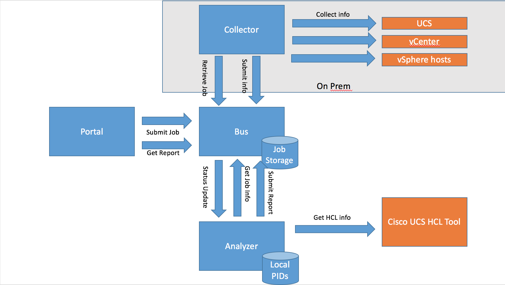
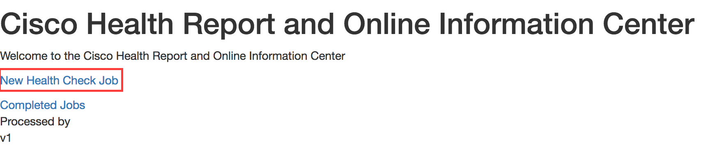
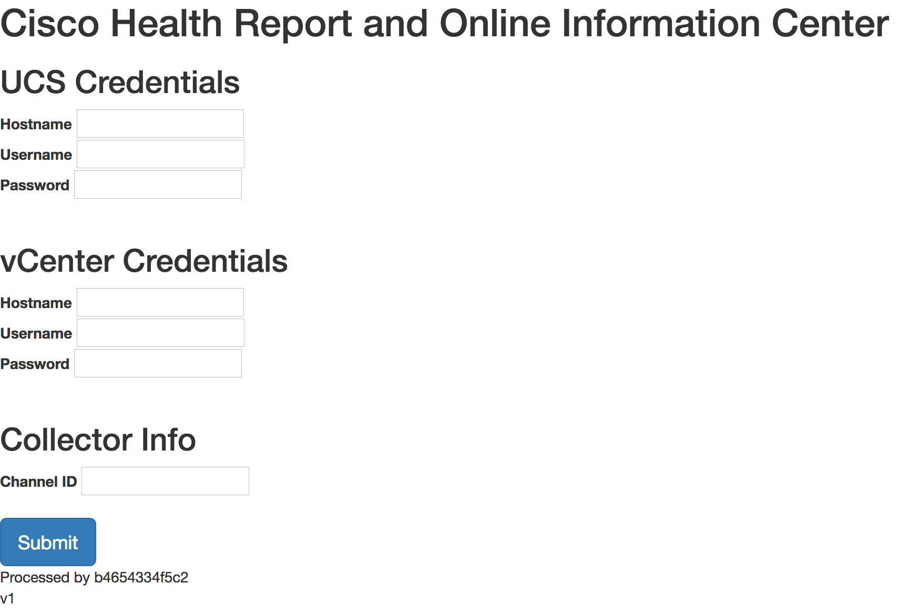
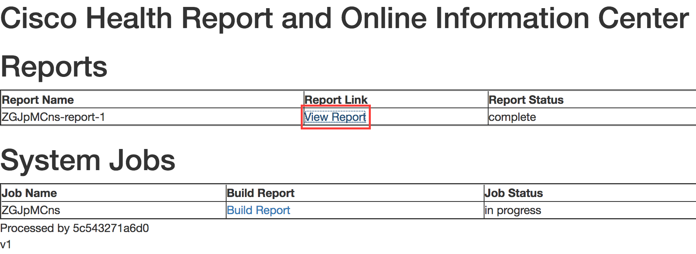
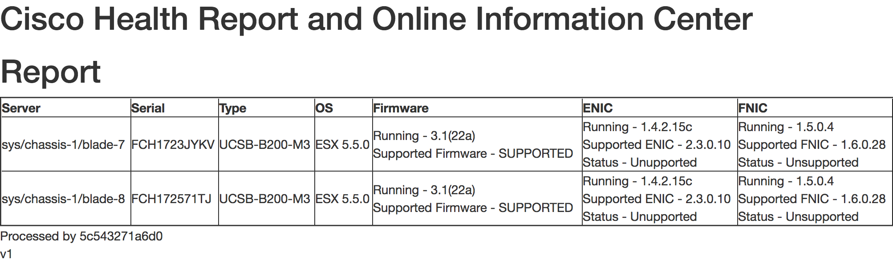

# CHROnIC

##**Cisco Health Report & ONline Information Collector**
This is an application designed to interact with infrastructure components, and perform an online analysis of them.

*The Challenge* - It can be tedious to collect the data needed for routine health analysis. For example, Cisco provides a HCL interface that can be used to verify whether a specific UCS hardware/software/driver configuration is fully supported. Multiple touch points are required across multiple different interfaces in order to verify this information:
1. UCS Manager -> Blade/Rack Model, CIMC Firmware Version, Adapter Model
2. vCenter/vSphere -> vSphere version on host
3. vSphere CLI -> Driver versions for the Ethernet NIC (enic) and Fiber Channel Adapter (fnic)

*The Solution* - Create an application that will enable interaction with UCS from the cloud. This particular application has several microservices, including:

* [Bus](https://github.com/imapex/CHROnIC_Bus) - Used as a basic HTTP-based message queue. [https://github.com/imapex/CHROnIC_Bus](https://github.com/imapex/CHROnIC_Bus)
* [Collector](https://github.com/imapex/CHROnIC_Collector) - On-prem component used to exchange core information between on-prem infrastructure and the Portal. Consumes messages from the queue. [https://github.com/imapex/CHROnIC_Collector](https://github.com/imapex/CHROnIC_Collector)
* [Portal](https://github.com/imapex/CHROnIC_Portal) - Information Collection service and agent used to push tasks into the queue. [https://github.com/imapex/CHROnIC_Portal](https://github.com/imapex/CHROnIC_Portal)
* [UCS ESX Analyzer](https://github.com/imapex/CHROnIC_UCS_ESX_analyzer) - Process data and generate reports which are pushed back into the queue. [https://github.com/imapex/CHROnIC_UCS_ESX_analyzer](https://github.com/imapex/CHROnIC_UCS_ESX_analyzer)

Contributors - Josh Anderson, Chad Peterson, Loy Evans

[Demo](https://www.youtube.com/watch?v=VEXby7V8Szs)



# Installation
The recommended installation process is to first deploy the Bus, then the Collector, then the UCS ESX Analyzer, and finally the Portal.
**See the UCS ESX Analyzer's documentation for supported UCS hardware**

## Local Laptop Install using Docker for Mac or Docker for Windows
Follow these instructions if you plan to run CHROnIC locally on your laptop.  You can either use pre-built containers or build them locally (this takes some extra time).

### Build containers locally and run

Download Repos and build base containers
```
git clone http://github.com/imapex/CHROnIC_Bus
git clone http://github.com/imapex/CHROnIC_Collector
git clone http://github.com/imapex/CHROnIC_Portal
git clone http://github.com/imapex/CHROnIC_UCS_ESX_analyzer

docker build -t chronic_bus CHROnIC_Bus/.
docker build -t chronic_collector CHROnIC_Collector/.
docker build -t chronic_portal CHROnIC_Portal/.
docker build -t chronic_ucs_esx_analyzer CHROnIC_UCS_ESX_analyzer/.
```

Run the Following containers locally in this order
```
docker run -d -p 5000:5000 --name chronic_bus chronic_bus
docker run -d -p 5001:5000 -e chronicbus=chronicbus:5000 --link chronic_bus:chronicbus --name chronic_collector chronic_collector
docker run -d -p 5003:5000 -e CHRONICBUS=http://chronicbus:5000 --link chronic_bus:chronicbus -e  HCL=http://ucshcltool.cloudapps.cisco.com/public/rest -e CHRONICPORTAL=http://localhost:80 --name chronic_ucs_esx_analyzer chronic_ucs_esx_analyzer
docker run -d -p 80:5000 -e CHRONICBUS=http://chronicbus:5000 --link chronic_bus:chronicbus -e CHRONICPORTAL=http://localhost:80 -e CHRONICUCS=http://localhost:5003 --name chronic_portal chronic_portal

```

### Run using Prebuilt containers
```
docker run -d -p 5000:5000 --name chronic_bus imapex/chronic_bus
docker run -d -p 5001:5000 -e chronicbus=chronicbus:5000 --link chronic_bus:chronicbus --name chronic_collector imapex/chronic_collector
docker run -d -p 5003:5000 -e CHRONICBUS=http://chronicbus:5000 --link chronic_bus:chronicbus -e  HCL=http://ucshcltool.cloudapps.cisco.com/public/rest -e CHRONICPORTAL=http://localhost:80 --name chronic_ucs_esx_analyzer imapex/chronic_ucs_esx_analyzer
docker run -d -p 80:5000 -e CHRONICBUS=http://chronicbus:5000 --link chronic_bus:chronicbus -e CHRONICPORTAL=http://localhost:80 -e CHRONICUCS=http://localhost:5003 --name chronic_portal imapex/chronic_portal

```

Get the collector's ID:
```
docker logs chronic_bus
Check Bus: http://chronicbus:5000/api/get/cSzyGtq9
```
In our example channel ID is cSzyGtq9


Navigate to [http://localhost](http://localhost) and submit a new job with channel id of cSzyGtq9

**Use the Portal to Perform a Discovery:**
* [Discovery](#discovery) See below to learn how to perform a discovery

# Discovery<a name="discovery"></a>
* Access http://127.0.0.1 from your browser
* Click "New Health Check Job"

* Enter the IP/Hostname, Username and Password for your UCS Manager
* Enter the IP/Hostname, Username and Password for your vCenter
* Enter the Channel ID found in the logs above
* Click Submit

* You will now be taken to the jobs page. It will take several minutes to collect the relevant information from your UCS Manager, vCenter and vSphere hosts. Refresh the page to view the current status. When complete, a report will be visible in the top section of the jobs page.

* Click the report link to view the report. The report will show you the information about the servers it discovered, and show you whether they are Supported or Unsupported according to the HCL.



Clean up commands
```
docker kill $(docker ps -q)
docker rm $(docker ps -a -q)
```
